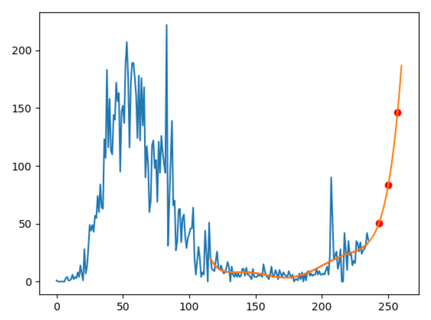

# canada
In order to install Python libraries, see the following site for novice:
https://github.com/ytakefuji/python-novice

The number of daily deaths due to the covid-19 in canada from March 10 to Oct. 31 in 2020.
Data was downloaded from:
 https://covid.ourworldindata.org/data/ecdc/new_deaths.csv

The prediction is based on the 6th degree polinomial curve fitting.

# Prediction is as follows:
# Nov. 7 deaths 47
# Nov. 14 deaths 77
# Nov. 21 deaths 134
