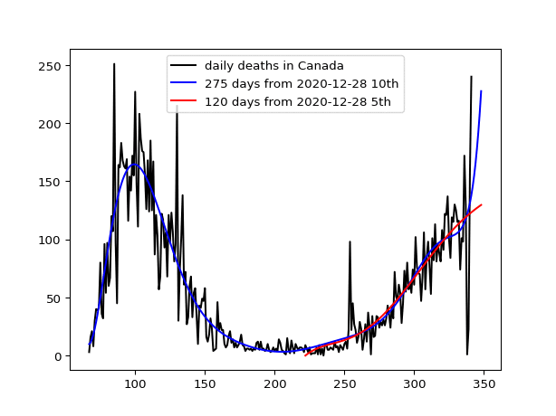

# canada

In order to run Python programs, see the following site for novice to install the necessary libraries:
https://github.com/ytakefuji/python-novice

The number of daily deaths due to the covid-19 can be used for measuring the success of the individual policies in the world.  Data in canada from March 10 to Oct. 31 in 2020 is used for examining the behavior of the pandemic. Policymakes need to control the pandemic by their policy based on the behavior of the pandemic. The prediction of the number of daily deaths in the near future plays a key role in the control.

Data was downloaded from:
 https://covid.ourworldindata.org/data/ecdc/new_deaths.csv

